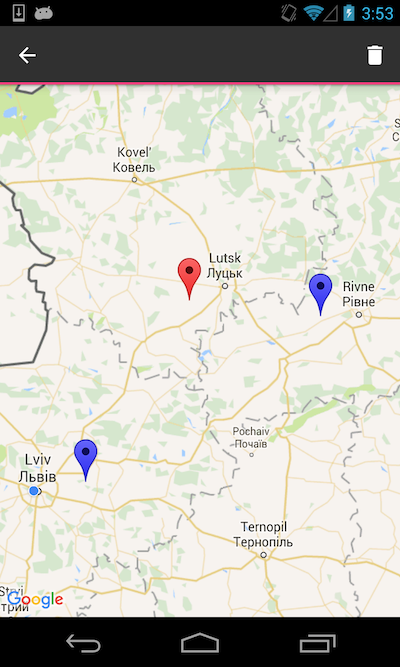

# Summary

Sample project to show how to work with [Google Maps API](https://developers.google.com/maps/documentation/android-api/) using [Kotlin](https://kotlinlang.org/docs/reference/) language and [Android Architecture Components](https://developer.android.com/topic/libraries/architecture/index.html) libraries.

    

